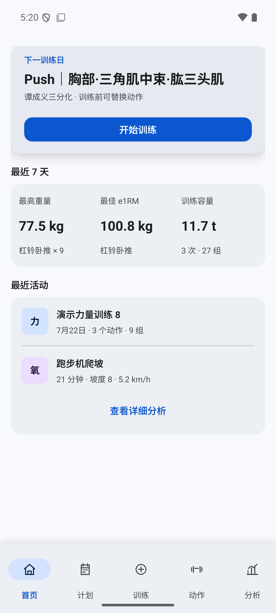
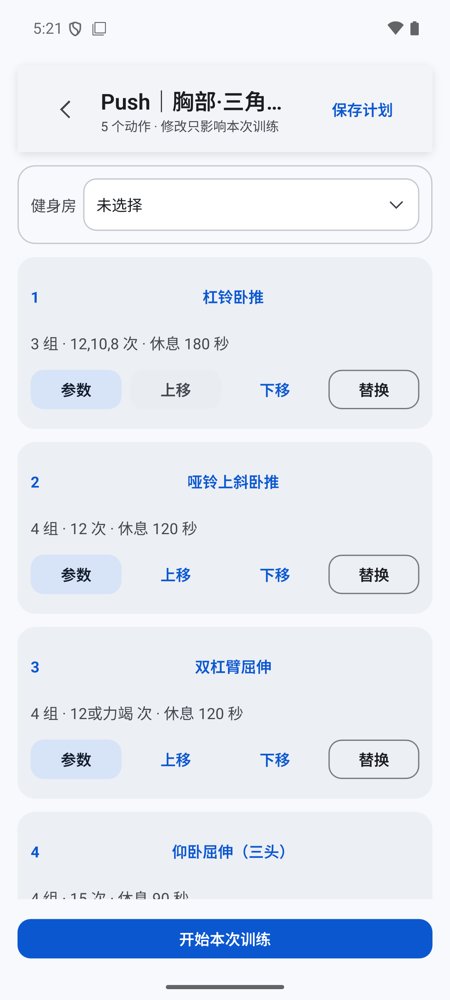
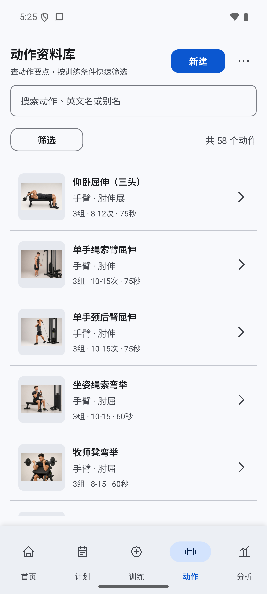

<div align="center">

# 训迹 FitTrack

**离线优先的力量训练记录应用**

用于编辑训练计划、逐组记录训练，并在历史和分析页面查看结果。

[](https://github.com/54xkeee/fittrack/releases/latest)


[Android 下载](https://github.com/54xkeee/fittrack/releases/latest) · [Windows 下载](https://github.com/54xkeee/fittrack/releases/latest) · [问题反馈](https://github.com/54xkeee/fittrack/issues)

</div>

## 概览

训迹提供计划编辑、逐组训练记录、动作资料查询、场馆器械管理、历史分析和有氧记录。训练数据保存在本地，可通过备份与恢复迁移。

- 系统计划、个人计划与自由训练
- 重量、次数、力竭、备注、器械与逐组进度记录
- 训练日历、历史详情、容量与动作趋势
- 有氧记录、场馆与器械管理
- 本地 SQLite 存储、备份与恢复；不要求账号

## 项目能力

### 动作资料库

动作资料包含中文名、英文名、别名、肌群、器械、动作步骤、注意事项、发力要点、常见错误、图片和来源信息。动作详情显示媒体署名与许可信息；个人动作可用于计划和训练记录。

### 面向训练业务的关系数据

SQLite Schema v8 保存动作与肌群、图片与替代动作、计划与训练日、场馆与器械、训练会话与动作、正式组与追加组、有氧记录等关系。训练准备内容先保存在草稿中；开始训练时，应用使用事务创建训练会话和本次动作快照。之后编辑计划不会改写已经开始的训练。

### 训练记录

准备页支持增删、替换和排序。训练页提供当前动作和当前组操作、休息计时、备注、追加组与未完成训练恢复。力量训练和有氧记录可在历史与分析页面查询。

### Android 与桌面交付

界面使用 Qt Quick / QML，训练、计划、历史、备份与数据访问逻辑使用 C++。本次 Release 提供 Android APK 和 Windows 桌面包。界面采用 Material 3，支持浅色、深色主题和系统字体缩放。

## 实现细节

### 模块划分

`qml/` 保存页面、主题和通用组件；`src/` 按训练、计划、动作、历史、分析、有氧、场馆、备份和存储划分控制器与业务代码；`resources/` 保存内置动作、计划和图片资源；`android/` 保存 Android 平台配置；`tests/` 保存计算、数据库、导入、训练、历史、分析、有氧、场馆和备份测试。

### 本地数据

应用使用 SQLite。动作相关数据包括 `exercise`、`muscle`、`exercise_muscle`、`exercise_media`、`exercise_alternative` 和收藏记录；训练计划由计划、训练日、分组、动作和有氧目标组成；一次训练会保存会话、动作、正式组、追加组和有氧结果。健身房与器械独立保存，并可关联到训练记录。

数据库初始化时启用外键。当前 Schema 为 v8，包含版本记录、索引、触发器和升级逻辑。训练开始、计划排序、删除动作等需要同时修改多条记录的操作使用 SQLite 事务；失败时回滚，避免留下半完成数据。

### 训练快照与恢复

训练准备阶段在内存中维护草稿，修改动作、组数、顺序和有氧目标不会提前写入训练历史。用户开始训练后，应用创建训练会话，并把本次动作、组和有氧目标写入数据库。已开始训练保留自己的记录，后续编辑原计划不会影响历史。未完成训练可在下次启动后继续或放弃。

### 关键计算

- **训练容量**：每个已完成组按 `重量 × 实际次数 × 负重系数` 累加。双哑铃动作的系数为 2；单侧动作仅在标记为双侧完成时乘以 2；自重动作只有记录了额外负重时才计入重量容量。追加组使用同一规则。
- **最高重量**：只比较已完成且重量、次数均大于 0 的训练组。重量相同的组会合并统计组数，并保留其中最大的次数。
- **估算 1RM**：对非自重动作使用 Epley 公式 `重量 × (1 + 次数 / 30)`，在一次训练或时间范围内取最大的有效结果。自重动作不生成 1RM。
- **趋势与肌群统计**：按训练结束时间聚合已完成记录；容量、最高重量和 1RM 分别计算。肌群统计通过动作与肌群关联表汇总正式组，可切换主要刺激和次要参与。

### 备份与性能处理

备份与恢复由应用内服务处理；动作和计划种子使用内容摘要避免重复导入。动作列表、历史记录和有氧列表按页面需要加载，历史和有氧记录使用分页查询。构建使用 CMake + Ninja，Android 构建脚本可输出 ARM64 手机 APK 与 x86_64 模拟器 APK。

## 截图

<table>
  <tr>
    <td align="center"><br><b>训练首页</b></td>
    <td align="center"><br><b>训练准备</b></td>
    <td align="center"><br><b>逐组记录</b></td>
  </tr>
  <tr>
    <td align="center"><br><b>动作资料库</b></td>
    <td align="center"><br><b>深色主题</b></td>
  </tr>
</table>

## 下载与安装

前往 [GitHub Releases](https://github.com/54xkeee/fittrack/releases/latest)：

- **Android**：下载 `FitTrack-*-arm64-v8a.apk`，适用于 Android 10+ 的 ARM64 设备。
- **Windows**：下载 `FitTrack-*-windows-x64.zip`，解压后运行 `fittrack.exe`。

APK 为可侧载开发包；首次安装时，Android 可能要求允许当前应用安装未知来源应用。

## 技术栈

`Qt 6 Quick / QML` · `C++17` · `SQLite` · `CMake + Ninja` · `Material 3` · `Android SDK / NDK`

## 本地构建

准备 Qt 6.11、CMake、Ninja、JDK 21，以及 Android SDK 36 与 NDK r27c 后，在仓库根目录执行：

```powershell
powershell -ExecutionPolicy Bypass -File .\fittrack\scripts\build-android.ps1
```

更多构建与架构资料见 [docs](docs)。

## 许可与致谢

- [第三方说明](docs/fittrack-third-party-notices.md)
- [动作媒体署名](docs/fittrack-media-credits.md)
