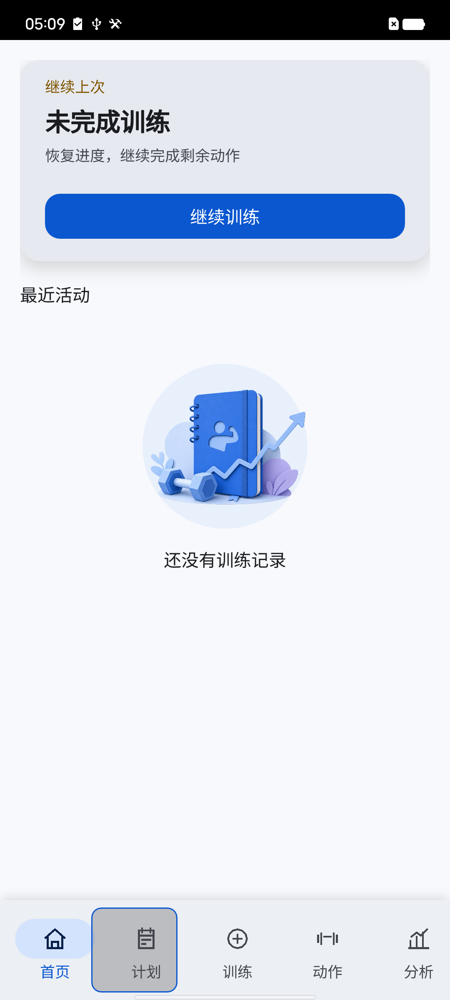
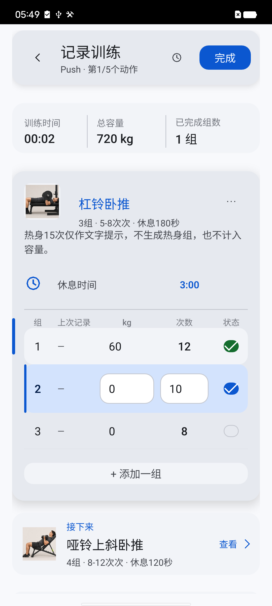
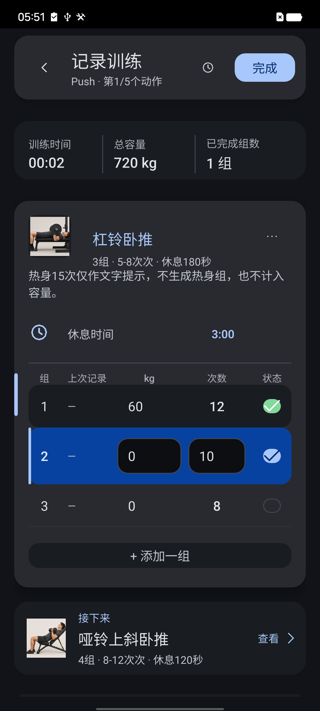

<div align="center">

# 训迹 FitTrack

一款离线优先的 Android 健身记录应用，把训练计划、逐组记录、休息计时与长期进步分析完整串联起来。

[](https://github.com/54xkeee/fittrack/releases/latest)


[下载最新版 APK](https://github.com/54xkeee/fittrack/releases/latest)

</div>

## 界面

<table>
  <tr>
    <td align="center"><br>首页</td>
    <td align="center"><br>记录训练</td>
    <td align="center"><br>深色主题</td>
  </tr>
</table>

## 功能

- **完整训练编排**：支持训练计划与自由训练，可按实际节奏添加、调整和排序动作。
- **专业逐组记录**：集中记录重量、次数、完成状态、训练备注与休息时间，当前组和下一动作一目了然。
- **智能休息衔接**：完成一组即可进入休息计时，让组间节奏更稳定，减少训练过程中的重复操作。
- **长期进步追踪**：通过训练日历、历史记录、训练容量和趋势图表回看每一次积累。
- **本地数据管理**：训练数据保存在设备本地，并提供备份与恢复能力，离线也能完整使用。
- **现代 Android 体验**：采用 Material 3 界面体系，适配浅色与深色主题，训练中的重点信息拥有清晰层级。

## 安装

1. 打开 [Releases](https://github.com/54xkeee/fittrack/releases/latest)。
2. 下载 `FitTrack-0.1.0-debug-arm64-v8a.apk`。
3. 在 Android 10 或更高版本的 ARM64 手机上安装。

首次侧载时，系统可能要求允许“安装未知应用”。覆盖安装会保留本地数据；卸载前建议先在应用内导出备份。

## 技术栈

- Qt 6 Quick / QML
- C++17
- SQLite
- CMake + Ninja
- Material 3

## 构建

```powershell
powershell -ExecutionPolicy Bypass -File .\fittrack\scripts\build-android.ps1
```

APK 输出到 `fittrack/build-android-arm64-debug/android-build/fittrack.apk`。

## 目录

```text
fittrack/qml/        界面与组件
fittrack/src/        业务与数据层
fittrack/resources/  内置数据与图片
fittrack/tests/      自动化测试
docs/                项目文档
```

第三方组件和图片许可见 [第三方说明](docs/fittrack-third-party-notices.md) 与 [媒体署名](docs/fittrack-media-credits.md)。
