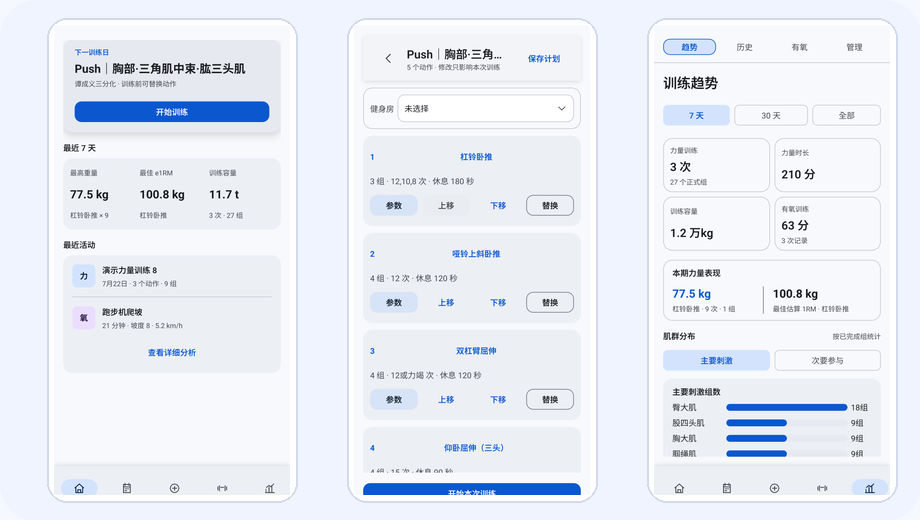
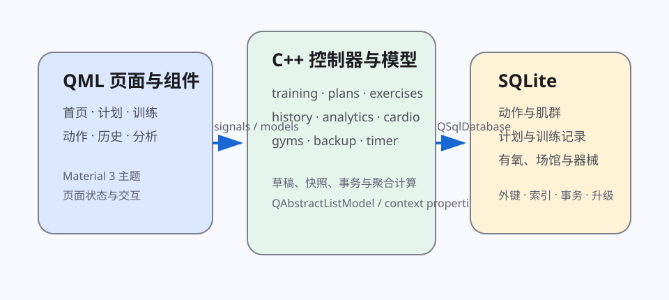
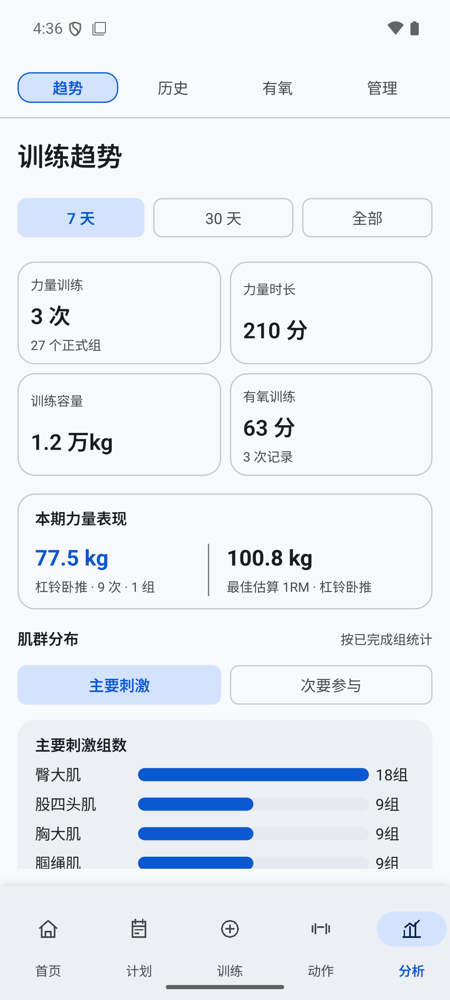

<div align="center">

# 训迹 FitTrack

**连接训练计划、动作资料与长期训练记录的离线健身应用**

Qt Quick · C++ · SQLite · Android · Windows

[下载 Android 版](https://github.com/54xkeee/fittrack/releases/latest) · [下载 Windows 版](https://github.com/54xkeee/fittrack/releases/latest) · [查看文档](docs)

<br>



</div>

## 项目主张

训练计划用于安排训练内容，动作资料提供训练参考，训练记录保存实际完成结果。FitTrack 使用同一套本地数据模型管理这三类信息。

计划引用动作资料；开始训练时，计划内容保存为本次训练的独立快照；重量、次数、器械和备注写入历史记录；分析页面基于已完成记录计算训练容量、力量表现和肌群分布。

```text
训练计划 → 训练准备草稿 → 本次训练快照 → 逐组训练记录 → 历史与趋势分析
```

## 运行机制

### 计划定义训练结构

系统计划、个人计划和自由训练使用同一套训练模型。计划可包含训练日、动作顺序、组数、目标次数、休息时间和有氧目标。

### 动作资料提供训练上下文

动作资料包含中英文名称、别名、肌群、器械、步骤、发力要点、注意事项、常见错误、图片和来源信息。动作可用于计划选择、训练准备、训练过程和历史查询。

### 快照保存当次训练

训练准备阶段的修改只存在于内存草稿中。用户可以替换动作、调整顺序、修改组数或选择器械。确认开始后，程序在同一 SQLite 事务中创建训练会话、动作快照、组记录和有氧目标。之后编辑原训练计划，不会改变已经开始或已经完成的训练。

### 实际结果进入分析

完成训练组时，重量、次数和完成状态立即写入数据库。未完成训练可以在应用重新启动后恢复。历史和分析模块基于实际完成记录计算训练容量、最高重量、估算 1RM、动作趋势和肌群训练分布。

## 核心设计

### 统一训练模型

计划、动作、训练会话和历史记录使用关联数据表达。

```text
TrainingPlan → PlanDay → PlanExercise

Exercise → Muscle / Media / Alternative

WorkoutSession → WorkoutExercise → SetRecord
                                 └→ AppendSetRecord
```

同一个动作可以出现在不同计划和训练中，并保留统一的资料、肌群和媒体信息。

### 训练快照

训练计划表达未来安排，训练快照保存某一次真实执行。快照保存当时的动作、顺序、目标组数、休息时间和器械信息，因此历史记录不依赖计划的当前状态。

### 本地关系数据

FitTrack 使用 SQLite 保存动作、肌群、训练计划、训练会话、组记录、有氧记录、健身房和器械。数据库层处理外键和业务约束、多表事务与失败回滚、Schema 版本升级、完整性检查、JSON 备份恢复和 SQLite 一致性快照导出。核心功能可在无网络环境下使用。

### 动作资料导入

内置动作、计划和媒体资源随应用提供。动作种子导入器将资源中的结构化资料写入本地数据库，并保存内容摘要以避免重复导入。资料字段包括名称和别名、器械、肌群关系、动作说明、图片、来源与许可信息。

### 关键计算

- 训练容量按 `重量 × 实际次数 × 负重系数` 计算；双哑铃和双侧动作按规则乘以 2，自重动作仅在记录额外负重时计入重量容量。
- 最高重量只比较已完成且重量、次数均有效的训练组；相同重量合并统计组数并保留最大次数。
- 非自重动作使用 Epley 公式 `重量 × (1 + 次数 / 30)` 估算 1RM，并取有效结果中的最大值。
- 趋势和肌群统计按训练结束时间、动作与肌群关联表聚合已完成记录。

## 架构



Android 与 Windows 共用主要 QML 和 C++ 业务代码。Android 端补充休息计时桥接、通知权限与系统设置入口、触感反馈和文档 URI 文件访问；Windows 端使用 Qt 部署工具生成独立运行目录。

更多状态流、数据库结构和平台边界见：

- [当前架构](fittrack/ARCHITECTURE.md)
- [全局架构说明](docs/fittrack-global-architecture.md)
- [Android 构建说明](docs/fittrack-android-build.md)

## 界面

<table>
  <tr>
    <td align="center"><br><b>训练准备：参数、替换与排序</b></td>
    <td align="center"><br><b>逐组训练：记录与休息计时</b></td>
    <td align="center"><br><b>训练分析：容量、1RM 与肌群分布</b></td>
  </tr>
</table>

## 测试与构建

测试覆盖训练分析、数据库初始化、动作与计划导入、训练会话、训练历史、趋势分析、有氧记录、场馆器械和备份恢复，并保留可选的 QML 导航与视觉测试。

项目使用 Qt 6.11、C++17、CMake 和 Ninja。Android 构建脚本可输出 ARM64 手机 APK 与 x86_64 模拟器 APK：

```powershell
powershell -ExecutionPolicy Bypass -File .\fittrack\scripts\build-android.ps1
```

测试、发布、签名和平台配置见 [`docs`](docs)。

## 下载

前往 [GitHub Releases](https://github.com/54xkeee/fittrack/releases/latest)。

- Android：`FitTrack-*-arm64-v8a.apk`，适用于 Android 10 及以上的 ARM64 设备。
- Windows：`FitTrack-*-windows-x64.zip`，解压后运行 `fittrack.exe`。

## 第三方内容

- [第三方组件与许可](docs/fittrack-third-party-notices.md)
- [动作媒体署名](docs/fittrack-media-credits.md)
- [动作数据映射报告](docs/fittrack-exercise-mapping.md)
