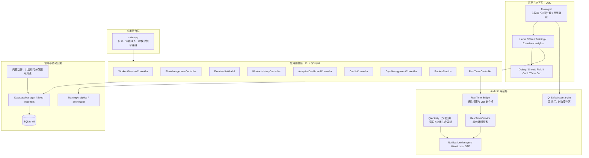
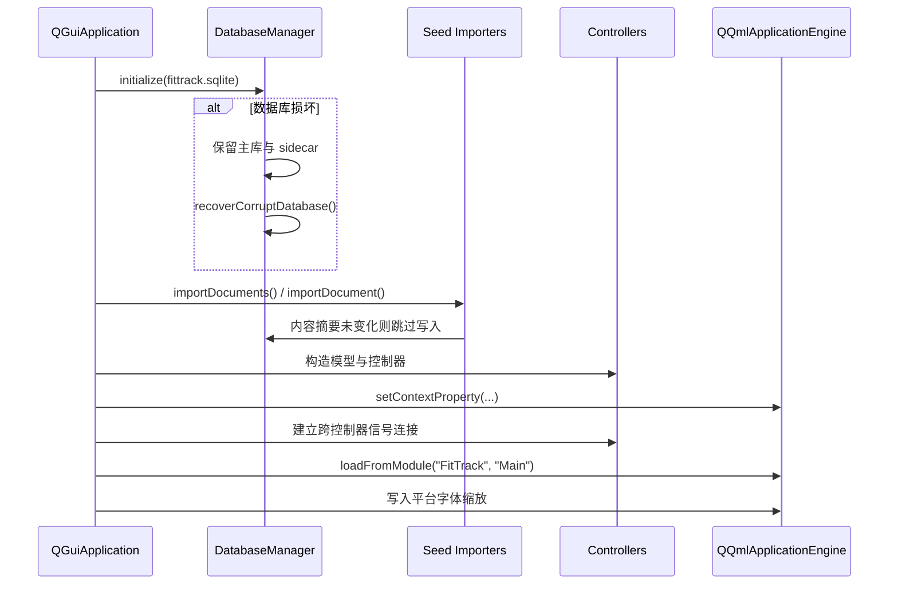
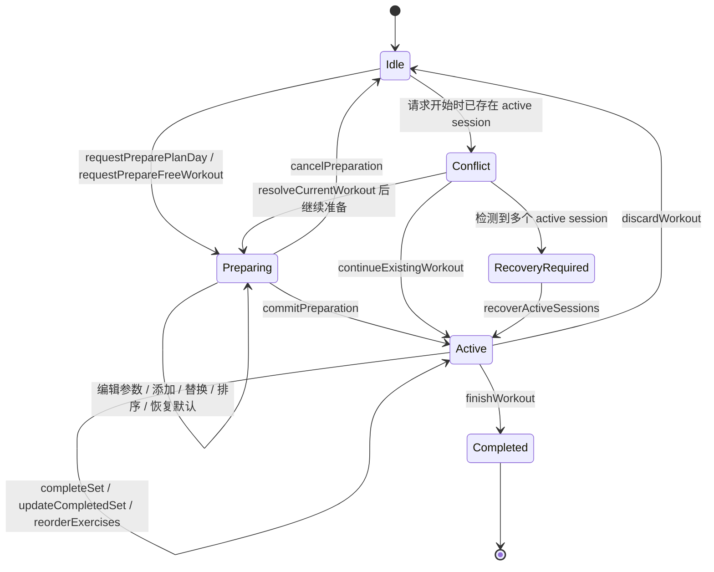
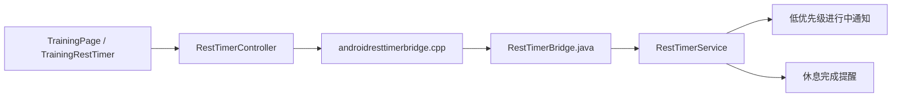

# FitTrack 0.1.0 全局架构

> 本文基于 2026-07-22 的 `codex/material-refactor` 分支核验，描述当前实现，而不是未来规划。
> 当前应用版本仍为 `versionName 0.1.0`、`versionCode 1`。

## 1. 产品定位与架构边界

FitTrack 是一个本地优先的个人健身训练伙伴，核心目标是：

- 管理动作目录、系统计划和个人计划；
- 在开始训练前编辑本次训练快照；
- 训练中记录每组重量、次数、力竭状态、器械和备注；
- 提供组间休息计时、历史记录、有氧记录和统计分析；
- 在 Android 上离线运行，不依赖账号、云端或网络接口。

当前架构明确不包含登录、云同步、社交、饮食管理、自动重量建议和复杂周期算法。QML 负责界面与交互编排，C++ 控制器负责业务规则和事务，SQLite 是唯一业务数据源，Java 仅承接 Android 平台能力。

### 1.1 仓库边界

当前仓库同时保留两个互不依赖的项目：

- `fittrack/` 是当前持续开发目标，即 Android 健身训练伙伴“训迹 FitTrack”；
- 根目录的 `StudentGradeSystem.pro`、`app/`、根目录 `tests/` 和对应构建脚本属于历史成绩管理系统，只作保留，不参与 FitTrack 的构建、运行或测试。

两者不共享业务代码、数据库或发布产物。除非任务明确指向历史项目，后续架构、开发和验收均以 `fittrack/` 及 `docs/fittrack-*.md` 为范围。

### 1.2 FitTrack 目录职责

| 路径 | 所属层 | 职责 |
| --- | --- | --- |
| `fittrack/src/app/` | 组合层 | 创建数据库、模型和控制器，注入 QML，连接跨模块信号 |
| `fittrack/src/training/` | 训练服务 | 训练准备草稿、活动会话、组记录、排序、完成和放弃 |
| `fittrack/src/plans/` | 计划服务 | 系统/个人计划、训练日、分区、动作参数和计划有氧 |
| `fittrack/src/exercises/` | 动作模型 | 动作检索、筛选、详情、收藏和自定义动作 |
| `fittrack/src/history/`、`fittrack/src/analytics/`、`fittrack/src/cardio/` | 记录与分析 | 历史详情、训练统计、动作趋势和有氧记录 |
| `fittrack/src/gyms/`、`fittrack/src/backup/`、`fittrack/src/timer/` | 支撑服务 | 场馆器械、备份恢复和休息计时 |
| `fittrack/src/storage/` | 存储层 | SQLite v8 初始化、迁移、恢复和种子导入 |
| `fittrack/qml/pages/` | 页面层 | 五个一级入口及训练准备、历史、有氧、管理等页面 |
| `fittrack/qml/components/`、`fittrack/qml/theme/` | UI 基础层 | 共用控件、弹层、排序、详情、输入和设计令牌 |
| `fittrack/resources/` | 内置内容 | 动作/计划 JSON、审核图片和提示音资源 |
| `fittrack/android/` | Android 适配 | Manifest、资源、通知桥和前台计时服务 |
| `fittrack/scripts/` | 工程化 | Android 构建、签名、校验、侧载打包和动作目录生成 |
| `fittrack/tests/` | 质量层 | 15 项 CTest、QML 交互/视觉基准及集成测试 |
| `fittrack/config/`、`fittrack/licenses/` | 发布配置 | 签名配置样例和可分发许可证材料 |

## 2. 总体架构



依赖方向保持单向：

```text
QML -> C++ 控制器/模型 -> SQLite
                    -> Android JNI 桥 -> Android 系统服务
```

QML 不直接执行 SQL，Java 不保存训练业务模型，Android 平台代码不反向依赖 QML 页面。

## 3. 构建模块

顶层构建入口是 [`fittrack/CMakeLists.txt`](../fittrack/CMakeLists.txt)。

| CMake 目标 | 主要内容 | 依赖边界 |
| --- | --- | --- |
| `fittrack_domain` | `TrainingAnalytics`、`SetRecord` | 仅 Qt Core，不访问数据库和 UI |
| `fittrack_storage` | `DatabaseManager`、动作/计划种子导入 | Qt Core + Qt Sql |
| `fittrack_ui_models` | `ExerciseListModel` | 依赖存储层，向 QML 暴露列表模型 |
| `fittrack_services` | 训练、计划、历史、分析、有氧、场馆、备份、计时控制器 | 依赖领域层和 SQLite |
| `fittrack_action_images` | 审核过的本地动作图片资源 | 独立 Qt Resource 静态库 |
| `fittrack` | `main.cpp`、QML 模块、Android 打包入口 | 组合上述模块，不承载业务规则 |

Android 当前配置：

- 应用名：“训迹”；
- 包名：`com.xuke.fittrack`；
- minSdk：29；
- compileSdk / targetSdk：36；
- ABI：手机包 `arm64-v8a`，模拟器包 `x86_64`，每个产物只包含一个 ABI；
- Qt：6.11.1；
- JDK：21；
- Build Tools：36.0.0；
- NDK：27.2.12479018；
- C++：C++17。

Manifest 使用 Qt 默认 `org.qtproject.qt.android.bindings.QtActivity`，项目不再维护自定义 Activity 或原生 WindowInsets 补丁。

## 4. 启动与依赖注入

应用组合根位于 [`fittrack/src/app/main.cpp`](../fittrack/src/app/main.cpp)。启动顺序如下：



### 4.1 启动关键函数

| 函数 | 职责 |
| --- | --- |
| `readResource(path)` | 读取内置动作和计划 JSON |
| `initializeDatabase(...)` | 创建数据目录、初始化/恢复数据库、导入种子数据 |
| `platformFontScale()` | 读取测试覆盖值或 Android 系统字体缩放，并限制在 `0.85–2.0` |
| `main(...)` | 构造依赖、注入 QML、连接信号并启动事件循环 |

### 4.2 注入到 QML 的对象

`main.cpp` 通过 `QQmlContext::setContextProperty()` 注入：

- `exerciseModel`、`planExerciseModel`；
- `workoutController`；
- `planManagement`；
- `workoutHistory`；
- `analyticsDashboard`；
- `cardioController`；
- `gymManagement`；
- `backupService`；
- `restTimer`。

这种方式在 0.1.0 阶段简单直接，但 QML 静态类型检查能力弱于注册为正式 QML 类型的方案。

## 5. QML 页面与导航

主壳位于 [`fittrack/qml/Main.qml`](../fittrack/qml/Main.qml)。它使用 `StackLayout` 管理五个一级入口：

| 一级入口 | 页面 | 装载策略 |
| --- | --- | --- |
| 首页 | `HomePage` | 启动时直接创建 |
| 计划 | `PlanPage` | 首次访问时由 `Loader` 创建 |
| 训练 | `TrainingPage` | 首次访问时创建 |
| 动作 | `ExerciseLibraryPage` | 首次访问时创建 |
| 分析 | `InsightsPage` | 首次访问时创建 |

`InsightsPage` 内部再次懒加载分析、历史、有氧和管理四个子页面。这样避免启动时一次性创建全部重页面和查询全部列表。

训练准备页不是普通 Tab，而是覆盖在主壳上方的 `WorkoutPreparationPage`。准备期间主导航隐藏，避免“开始本次训练”按钮与底部导航争抢触控区域。

共用组件集中在 `qml/components/`：

- `Theme.qml`、`Typography.qml` 与训练领域适配 `WorkoutTheme.qml` 提供 Material 3 语义颜色、尺寸、排版和动效令牌；生产训练渲染器固定为 QML，React/WebView 只保留为显式开启的实验原型。
- `AppPage`、`AppTopAppBar`、`AppNavigationBar`、`AppBottomSheet`、`AppDialog`、`ConfirmDialog`、`AppSnackbar`、`OverlayHost` 与 `TaskFeedbackHost` 统一页面、表面和短暂反馈边界。
- `ExerciseDetailSheet`、共享的 `ExercisePickerSheet`、`ExerciseOrderSheet`、`EquipmentChoiceDialog` 已建立在 Bottom Sheet 语义上；删除、放弃与结束仍使用确认 Dialog。
- `NumberField`、`AppButton`、`IconButton` 统一触控尺寸与无障碍语义；`CurrentSetInputPanel` 承担当前组输入与提交，`TrainingRestTimer` 封装固定休息栏、Bottom Sheet 设置与后台提醒状态。
- `TrainingPage` 仍负责任务流编排，但训练准备和训练中的编辑、选择、创建与备注不再各自实现居中 Dialog。

## 6. SQLite 数据架构

数据库入口是 [`fittrack/src/storage/databasemanager.cpp`](../fittrack/src/storage/databasemanager.cpp)，当前 schema 版本为 v8。

### 6.1 表分组

| 数据域 | 主要表 |
| --- | --- |
| 元数据 | `app_meta` |
| 动作目录 | `muscle`、`exercise`、`exercise_muscle`、`exercise_media`、`exercise_alternative`、`favorite_exercise` |
| 训练计划 | `training_plan`、`plan_day`、`plan_section`、`plan_exercise`、`plan_cardio` |
| 场馆器械 | `gym`、`equipment_instance` |
| 训练执行 | `workout_session`、`workout_exercise`、`set_record`、`append_set_record` |
| 有氧 | `workout_cardio_target`、`cardio_record` |

### 6.2 数据不变量

- 启用 SQLite 外键并使用级联删除或 `SET NULL` 维护引用完整性；
- 内置计划只读，用户修改必须保存为个人计划或仅作用于本次训练；
- 训练开始时把计划复制为独立训练快照，后续修改计划不会改变进行中的训练；
- 动作顺序使用稳定 ID 加连续 `sort_order`，排序写入在事务中完成；
- 完成组保留目标次数、实际次数、重量、力竭、自重负荷方式和时间；
- 数据库版本高于应用支持版本时拒绝启动，避免旧应用破坏新库；
- 恢复备份前校验表和列白名单，未知字段不会进入 SQL 标识符。

### 6.3 种子导入

`ExerciseSeedImporter::importDocuments()` 和 `PlanSeedImporter::importDocument()` 对内置 JSON 计算 SHA-256，将摘要保存到 `app_meta`。内容未变化时直接跳过完整导入；内容变化时在事务内更新。

动作文字、计划 JSON 和允许再分发的图片编译进 Qt Resource。应用运行时不访问 MuscleDB 网站，也不依赖外部网络。

## 7. 训练核心状态机

训练状态由 [`WorkoutSessionController`](../fittrack/src/training/workoutsessioncontroller.h) 统一管理。



### 7.1 为什么先“准备”再“开始”

直接点击计划就落库会让参数调整、动作替换和排序不断写入半成品训练。当前实现先在内存中的 `m_preparation` 保存草稿，用户确认后由 `commitPreparation()` 在一个事务内生成：

1. `workout_session`；
2. 按顺序生成 `workout_exercise`；
3. 按每组目标生成 `set_record`；
4. 如有计划有氧，再生成 `workout_cardio_target`。

这样“准备失败”和“开始失败”不会留下半条训练记录。

### 7.2 关键训练函数

| 函数 | 作用 |
| --- | --- |
| `requestPreparePlanDay()` / `requestPrepareFreeWorkout()` | 检查当前训练冲突并建立准备草稿 |
| `preparePlanDay()` | 从计划复制动作默认组数、次数、休息和有氧目标 |
| `updatePreparedExercise()` | 调整本次训练的组数、次数和休息 |
| `restorePreparedExerciseDefaults()` | 恢复动作在草稿中的默认参数 |
| `addPreparedExercise()` / `replacePreparedExercise()` / `removePreparedExercise()` | 编辑准备草稿的动作集合 |
| `movePreparedExercise()` / `reorderPreparedExercises()` | 使用稳定草稿 ID 校验并更新顺序 |
| `savePreparationAsPlan()` | 把草稿事务化保存为个人计划 |
| `commitPreparation()` | 原子创建训练快照并进入 Active 状态 |
| `completeSet()` | 保存组数据、刷新会话并发出 `setCompleted(restSeconds)` |
| `reorderExercises()` | 校验完整 ID 集合，在事务中写回训练动作顺序 |
| `finishWorkout()` | 标记会话完成并触发历史/分析刷新 |
| `discardWorkout()` | 删除当前训练及其级联数据 |
| `loadSession()` | 从 SQLite 重建训练页需要的完整会话视图 |

训练页的 QML `Connections` 接收 `setCompleted(restSeconds)`，刷新当前输入；当休息秒数大于零时调用 `restTimer.start(restSeconds)`。

## 8. 计划、动作、历史和分析服务

| 控制器/模型 | 核心职责 | 对 QML 暴露的主要函数 |
| --- | --- | --- |
| `ExerciseListModel` | 动作搜索、部位/器械/集合筛选、收藏和自定义动作 | `ensureLoaded()`、`exerciseById()`、`toggleFavorite()`、`createCustomExercise()`、`updateCustomExercise()`、`deleteCustomExercise()`、`restoreSystemExercises()` |
| `PlanManagementController` | 个人计划、训练日、分区、动作和计划有氧 | `createPlan()`、`copyPlan()`、`addDay()`、`setCardio()`、`addSection()`、`updateExercise()`、`replaceExercise()`、`reorderExercises()` |
| `WorkoutHistoryController` | 分页历史、详情、已完成组修订和会话删除 | `reload()`、`loadMore()`、`selectSession()`、`updateCompletedSet()`、`deleteSession()` |
| `AnalyticsDashboardController` | 周期概览、动作趋势、肌群统计、场馆/器械筛选 | `setPeriodDays()`、`selectExercise()`、`setGymFilter()`、`setEquipmentFilter()`、`reload()` |
| `CardioController` | 跑步机/爬楼机记录、有氧汇总和训练后待补录目标 | `overview()`、`addTreadmill()`、`addStairClimber()`、`removeRecord()`、`clearPendingSession()` |
| `GymManagementController` | 场馆和器械实例目录 | `selectGym()`、`createGym()`、`renameGym()`、`removeGym()`、`createEquipment()`、`updateEquipment()`、`removeEquipment()` |
| `BackupService` | SQLite 快照、JSON 导出、校验、事务恢复和 SAF 文档读写 | `exportDatabase()`、`exportJson()`、`restoreJson()` |

这些控制器目前直接使用 `QSqlDatabase`，没有额外 Repository 层。这减少了 0.1.0 的抽象成本，但意味着 SQL 查询和业务规则主要集中在各控制器内。

### 8.1 用户操作到函数的调用路径

| 用户操作 | QML 入口 | C++ 业务入口 | 数据结果 |
| --- | --- | --- | --- |
| 从首页/计划开始训练 | `Main.requestPlanDay()` / `requestSuggestedOrContinue()` | `requestPreparePlanDay()` / `requestPrepareSuggestedDay()` | 只创建内存准备草稿，不写训练表 |
| 在准备页调整组数、次数、间歇 | `ExerciseParameterSheet` | `updatePreparedExercise()` / `restorePreparedExerciseDefaults()` | 更新 `m_preparation`，尚未落库 |
| 在准备页添加、替换、删除动作 | `ExercisePickerSheet` | `addPreparedExercise()` / `replacePreparedExercise()` / `removePreparedExercise()` | 更新草稿动作集合 |
| 保存准备页顺序 | `ExerciseOrderSheet.orderedIds()` | `reorderPreparedExercises()` | 按稳定草稿 ID 更新内存顺序 |
| 确认开始训练 | `WorkoutPreparationPage` 的开始按钮 | `commitPreparation()` | 一个事务写入会话、训练动作、目标组和计划有氧快照 |
| 查看动作做法 | 各页 `ExerciseDetailSheet.openExercise()` | `ExerciseListModel::exerciseById()` | 返回文字、肌群、步骤、本地媒体及署名 |
| 调整计划动作顺序 | `PlanPage` 的排序弹层 | `PlanManagementController::reorderExercises()` | 事务校验完整 ID 集合并写回连续 `sort_order` |
| 调整进行中动作顺序 | `TrainingPage` 的排序弹层 | `WorkoutSessionController::reorderExercises()` | 更新当前会话快照，不修改原计划 |
| 完成一组 | `CurrentSetInputPanel.completeRequested` | `completeSet()` | 写入重量、次数、力竭等，并发出 `setCompleted(restSeconds)` |
| 启动组间计时 | `TrainingPage.onSetCompleted` | `RestTimerController::start()` | 前台状态机计时，并尝试同步 Android 前台服务 |
| 完成训练 | `TrainingPage` 完成操作 | `finishWorkout()` | 会话改为完成，触发历史/分析刷新和可选有氧补录 |
| 恢复 JSON 备份 | `ManagementPage` | `BackupService::restoreJson()` | 校验并事务恢复，随后 `main.cpp` 刷新全部控制器 |

这一调用链的共同原则是：QML 只收集输入和展示状态；C++ 负责校验、事务与错误；SQLite 只由 C++ 访问。排序和训练开始等多行写入不得在 QML 中逐条拼接。

## 9. 休息计时架构

计时采用“应用内状态机 + Android 前台服务”双通道：



### 9.1 C++ 状态机

`RestTimerController` 暴露四个状态：`Idle`、`Running`、`Paused`、`Finished`。

| 函数 | 作用 |
| --- | --- |
| `start(seconds)` | 建立单调截止时间并尝试启动 Android 服务 |
| `pause()` | 先同步剩余时间，再冻结本地和平台计时 |
| `resume()` | 用暂停剩余量重建截止时间 |
| `reset()` | 清空本地状态并停止平台服务 |
| `synchronize()` | 应用回到前台时校准过期状态 |
| `refreshBackgroundAlertState()` | 刷新通知权限、频道和服务可用状态 |
| `requestBackgroundAlertPermission()` | 仅响应用户操作请求通知权限 |
| `openBackgroundAlertSettings()` | 打开当前应用通知设置 |

C++ 使用 `QElapsedTimer`，Android 服务使用 `SystemClock.elapsedRealtime()`；两者都是单调时钟，不受用户改系统时间或网络校时影响。

### 9.2 Android 通知状态

后台提醒状态为：

- `Unsupported`：非 Android；
- `Available`：权限、应用通知和完成频道均可用；
- `Requestable`：Android 13+ 尚未请求通知权限；
- `Disabled`：权限被拒绝、应用通知关闭或频道关闭；
- `Unavailable`：前台服务未能启动，但应用内倒计时继续。

开始计时不会自动弹通知权限。只有用户点击“开启后台提醒”时才请求一次；拒绝后显示“系统设置”。因此通知策略失败不会阻断训练记录或应用内倒计时。

### 9.3 Android 服务关键函数

| Java 函数 | 作用 |
| --- | --- |
| `RestTimerBridge.start()` | 安全调用 `startForegroundService()` |
| `backgroundAlertState()` | 合并权限、全局通知和频道状态 |
| `requestNotificationPermission()` | 记录已询问标记并主动请求权限 |
| `openNotificationSettings()` | 打开通知设置，失败时回退应用详情页 |
| `RestTimerService.onStartCommand()` | 分派 START / PAUSE / RESUME / STOP |
| `startOrResume()` | 设置单调截止时间、WakeLock 和前台通知 |
| `pauseTimer()` | 保存剩余量并释放 WakeLock |
| `complete()` | 有通知能力时发完成提醒，否则静默结束 |

WakeLock 的持有时间为剩余休息时间加 5 秒，并在暂停、停止、完成和服务销毁时释放。

## 10. 高版本 Android 窗口与键盘适配

Android 清单直接使用 Qt 6.11.1 提供的默认 `QtActivity`。项目已经删除自定义 Activity、原生 `WindowInsets` 分发和 `adjustNothing` 软键盘补丁，窗口与输入法行为回到 Qt 支持路径。

QML 通过 `SafeArea.margins` 消费系统栏和刘海边距：`AppPage` 把四向安全区叠加到页面 padding，`Main.qml` 把左右和底部安全区叠加到底部导航。键盘显示时，`Main.qml` 隐藏主导航；`TrainingPage` 的固定 footer 以页面高度为上限，并在内部使用 `ScrollView` 承载 `TrainingRestTimer` 和 `CurrentSetInputPanel`。这样大字体或键盘压缩可用高度时，当前组输入区仍可滚动访问，而不需要 Java 层推算 IME 高度。

此方案减少了应用自维护的 Android 窗口代码，但 Qt 6.11.1、API 36 和不同厂商输入法的最终表现仍必须通过模拟器与真机回归确认。

## 11. 跨模块同步

`main.cpp` 中的信号连接形成轻量事件总线：

| 事件 | 下游动作 |
| --- | --- |
| 动作目录 `catalogChanged` | 刷新计划动作模型 |
| 训练计划日变化 `planDaysChanged` | 刷新计划管理页 |
| 场馆目录 `catalogChanged` | 刷新训练控制器的场馆/器械引用数据 |
| 训练会话 ID 变化 | 重置旧会话的休息计时 |
| 备份恢复完成 `restored` | 重置计时并刷新全部模型/控制器 |
| 训练完成 `workoutFinished` | 刷新分析，并进入训练总结/有氧补录流 |
| 应用回到前台 | 同步计时、刷新后台提醒状态和字体缩放 |

这里不使用全局消息总线，所有跨模块连接都集中在组合根，便于追踪副作用。

## 12. 错误与恢复策略

- 控制器通过 `errorMessage` 向 QML 返回可展示错误；
- 多表写入使用事务，失败立即回滚；
- 训练冲突在原计划页保留请求上下文，由全局冲突弹窗处理，不在错误发生页强行跳转；
- 启动发现多个 active session 时进入 `RecoveryRequired`，由用户明确选择保留项；
- 数据库损坏时先备份主库和 sidecar，再创建新库；
- JSON 恢复先校验结构、表和列，恢复成功后统一刷新全部模型；
- Android 平台调用捕获运行时异常，平台能力失败不应破坏本地训练状态。

## 13. 测试与质量门禁

当前 CTest 共 15 项，覆盖：

- 领域计算；
- 数据库初始化、迁移、损坏恢复和未来版本拒绝；
- 动作与计划种子导入；
- 动作、计划、训练、历史、分析、有氧、场馆和备份控制器；
- SQL 查询数量性能门禁；
- 休息计时状态机；
- QML 导航、弹窗、触控、无障碍、排序和视觉基准。

主要命令：

```powershell
cmake --build D:\FitTrackBuild\windows-qt6.11.1 -j 6
cmake --build D:\FitTrackBuild\windows-qt6.11.1 --target all_qmllint -j 6
ctest --test-dir D:\FitTrackBuild\windows-qt6.11.1 -j 4 --output-on-failure
powershell -ExecutionPolicy Bypass -File C:\FitTrackDev\fittrack\scripts\build-android.ps1
```

Android 还执行 Gradle Lint、AAPT 清单检查、APK 签名检查、ZIP 对齐和 ELF LOAD 段检查。

## 14. 当前限制与技术风险

1. **正式发布产物**：当前提交已有通过离线门禁的 arm64/x86_64 Debug APK，以及 arm64 unsigned Release APK/AAB；尚无使用长期 Direct/PlayUpload 密钥签名的正式 APK/AAB。
2. **16 KB 页大小**：现有 Debug 与 unsigned Release 产物已通过 ZIP 16 KB 和 81/81 ELF LOAD 对齐检查；正式签名最终产物仍必须独立执行同一校验，不能从无签名产物推定。
3. **发布身份**：仓库提供 Direct 与 PlayUpload 签名 profile、密钥生成和校验脚本，但真实长期密钥仍由用户在仓库外创建和保管；同签名覆盖升级尚无真机证据。
4. **QML 类型安全**：上下文属性和动态 QVariant 结构便于迭代，但编译期类型约束有限。
5. **控制器 SQL 耦合**：控制器直接访问数据库，代码路径清晰，但继续扩展时需要防止重复查询和事务规则分散。
6. **训练页体量**：`TrainingPage.qml` 当前 1663 行；当前组输入、休息计时和器械选择已分别拆到三个组件，但页面仍承担训练正文、弹层和流程编排，是最大的 UI 维护热点。
7. **平台差异**：`x86_64` 模拟器适合验证高版本 Android API 与窗口路径，但不能代替原生 `arm64-v8a` 真机上的 ColorOS、通知、SAF、TalkBack、字体和输入法验收。
8. **运行证据边界**：文档中存在 API 36 模拟器回归记录，但当前仓库没有可复核的安装、启动、日志和截图证据；桌面离屏回归也不能替代 Android 真机视觉、TalkBack、通知和厂商后台策略验收。

## 15. 关键文件索引

| 范围 | 文件 |
| --- | --- |
| 构建入口 | [`fittrack/CMakeLists.txt`](../fittrack/CMakeLists.txt) |
| 应用组合根 | [`fittrack/src/app/main.cpp`](../fittrack/src/app/main.cpp) |
| 数据库 | [`fittrack/src/storage/databasemanager.cpp`](../fittrack/src/storage/databasemanager.cpp) |
| 动作种子 | [`fittrack/src/storage/exerciseseedimporter.cpp`](../fittrack/src/storage/exerciseseedimporter.cpp) |
| 计划种子 | [`fittrack/src/storage/planseedimporter.cpp`](../fittrack/src/storage/planseedimporter.cpp) |
| 训练业务 | [`fittrack/src/training/workoutsessioncontroller.cpp`](../fittrack/src/training/workoutsessioncontroller.cpp) |
| 计时状态机 | [`fittrack/src/timer/resttimercontroller.cpp`](../fittrack/src/timer/resttimercontroller.cpp) |
| 主导航 | [`fittrack/qml/Main.qml`](../fittrack/qml/Main.qml) |
| 训练准备页 | [`fittrack/qml/pages/WorkoutPreparationPage.qml`](../fittrack/qml/pages/WorkoutPreparationPage.qml) |
| 训练页 | [`fittrack/qml/pages/TrainingPage.qml`](../fittrack/qml/pages/TrainingPage.qml) |
| 当前组输入组件 | [`fittrack/qml/components/CurrentSetInputPanel.qml`](../fittrack/qml/components/CurrentSetInputPanel.qml) |
| 训练计时组件 | [`fittrack/qml/components/TrainingRestTimer.qml`](../fittrack/qml/components/TrainingRestTimer.qml) |
| 器械选择组件 | [`fittrack/qml/components/EquipmentChoiceDialog.qml`](../fittrack/qml/components/EquipmentChoiceDialog.qml) |
| Android 清单 / QtActivity 配置 | [`fittrack/android/AndroidManifest.xml`](../fittrack/android/AndroidManifest.xml) |
| Android 计时桥 | [`fittrack/android/src/com/xuke/fittrack/RestTimerBridge.java`](../fittrack/android/src/com/xuke/fittrack/RestTimerBridge.java) |
| Android 前台服务 | [`fittrack/android/src/com/xuke/fittrack/RestTimerService.java`](../fittrack/android/src/com/xuke/fittrack/RestTimerService.java) |
| 测试清单 | [`fittrack/tests/CMakeLists.txt`](../fittrack/tests/CMakeLists.txt) |

---

这份架构的核心判断是：FitTrack 0.1.0 不是“QML 页面直接操作数据库”的原型，而是一个以 SQLite 快照为事实来源、以 C++ 控制器为业务边界、以 QML 为交互层、以 Java 为 Android 能力适配层的本地应用。当前后续重构应继续保持这四层边界。
