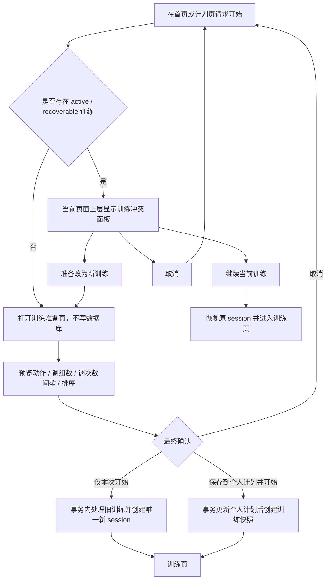
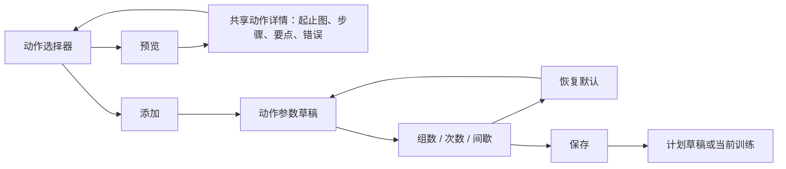

# FitTrack 交互、界面、性能重构与测试计划

更新时间：2026-07-14

状态：R1–R5 桌面门禁满足；R6 正在实施

范围：训练启动、训练准备、动作预览、动作添加与组数配置、排序、性能、移动端视觉和完成度审计

## 1. 本轮目标

本轮不是继续堆叠零散功能，而是先修复训练主链路的状态错误，再建立可复用的动作交互，最后完成性能和视觉重构。

最终必须满足：

1. 任意时刻最多只有一场进行中训练，旧训练不会被静默覆盖或丢弃。
2. 操作失败或状态冲突必须在用户当前所在页面立即出现，不能藏在其他页面。
3. 计划准备、正式训练和添加动作时都能点开动作详情，查看已审核的本地动作图、步骤、发力要点、注意事项和常见错误。
4. 开始训练前存在不落库的准备阶段，可调整动作、顺序、组数、次数和间歇，再选择仅本次使用或保存到个人计划。
5. 添加动作时先预览、再配置、后保存；预览和取消不得产生数据修改。
6. 排序必须在真实触控界面可用，并在重载、重启后保持。
7. 优化必须有启动耗时、查询次数、帧时间和真机数据作为依据，不能只凭主观感受宣布“已流畅”。
8. UI 以 Android 竖屏单手使用为主，建立现代运动训练产品的视觉层级，不再依赖字符图标、层层菜单和连续描边卡片。

## 2. 已确认问题与风险等级

| 编号 | 等级 | 已确认事实 | 当前风险 |
|---|---|---|---|
| START-01 | P0 | 计划页调用 `startPlanDay()` 失败后不在本页提示；错误被 `TrainingPage` 和首页监听 | 用户不知道为什么无法开始，之后在错误页面看到过期提示 |
| START-02 | P0 | `active()` 只看内存 session ID，`hasUnfinished()` 只查数据库；重启后两者可能分别为 `false/true` | 可能创建第二条 active 训练，恢复时只看到最新一条 |
| START-03 | P0 | 数据库没有“最多一条 active 训练”的约束 | 连点、重启或未来并发调用可能破坏核心状态 |
| PLAN-01 | P0 | 计划中编辑的 `rest_seconds` 在创建训练快照时没有保存到 `workout_exercise`，训练加载时使用动作库间歇 | 用户保存的计划参数可能不生效 |
| SORT-01 | P0 | 计划页拖动源没有实际随指针移动，难以进入其他 `DropArea` | 拖动排序在真实界面不可用 |
| SORT-02 | P0 | 删除后不归一化顺序，新增使用 `COUNT(*)`，可能产生重复 `sort_order` | 重载后的顺序不稳定 |
| PREVIEW-01 | P1 | 完整动作详情写死在动作库页面内，计划页和训练页不能复用 | 训练中无法快速确认动作做法 |
| ADD-01 | P1 | 添加动作整行点击后立即落库，没有“预览—配置—确认”流程 | 容易误加，无法在添加前设置组数 |
| CONFIG-01 | P1 | 计划参数可以保存，但没有恢复默认；开始按钮会直接创建 session，没有准备草稿 | 用户缺少安全的试改、取消和恢复入口 |
| PERF-01 | 桌面关闭 | 动作目录已改为 3 条固定批量 SQL，58 项不再逐动作查询 | 真机搜索响应仍待测量 |
| PERF-02 | 桌面关闭 | 首页以外的一级页面和动作模型按首次访问加载 | 真机首帧与切页帧时间仍待测量 |
| PERF-03 | 桌面关闭 | 动作与计划种子使用 SHA-256 摘要；内容未变时分别只执行 1 条查询 | 真机冷/热启动仍待测量 |
| PERF-04 | 已关闭 | CMake 只打包 `resources/images/exercises/shareable/`；58 张引用图全部进入 APK，MuscleDB、旧目录和 Inter 字体均未进入 | 包内探针与种子测试已验证 |
| PERF-05 | 桌面关闭 | 历史与有氧按 50 条分页，历史详情固定 5 条 SQL，有氧趋势固定最近 30 次 | 1000 次训练数据集与真机内存仍待验收 |
| PERF-06 | 桌面关闭 | 12 动作/48 组训练恢复由 83 条降至固定 5 条 SQL | 已达到第 9 节冻结的 ≤5 条桌面门槛；真机耗时仍待验收 |
| MAINT-01 | P1 | `TrainingPage.qml`、`PlanPage.qml`、`ExerciseLibraryPage.qml` 分别约 1862、1303、1599 行 | 修改风险高，状态与弹层容易互相污染；文件大本身不等于性能问题，但会放大回归风险 |
| MAINT-02 | 部分关闭 | 训练页 14 个操作弹层和 4 个确认框已统一为 `AppDialog`/`ConfirmDialog`；其他低频页面仍存在原生 `Dialog` 或 `Menu` | 训练主流程已统一，其他页面留待后续 |
| UI-01 | 部分关闭 | Unicode 字符图标已统一替换为 `AppIcon`/`PathSvg`，字符图标回归门禁已建立；计划和训练仍存在原生 `Menu` 与多层隐藏操作 | 图标体系已关闭，菜单与信息层级仍待后续收口 |
| TEST-01 | 桌面关闭 | active 冲突和排序均已覆盖真实 QML 点击/`QTouchEvent`，并验证取消、保存和持久化 | Android 真机触控仍属于 R6 |
| TEST-02 | P1 | 当前截图测试只保存 PNG，不与批准基准图做差异比较；QML 主流程集中在一个大测试函数 | 视觉退化不会让测试失败，前一步失败会跳过大量后续场景 |
| A11Y-01 | 桌面关闭 | 1.0/1.3/1.5/2.0 倍字体已覆盖训练主流程、训练准备、全部训练弹层和紧凑屏；字号继承系统缩放，上限为 2.0 | ColorOS 真实字体仍需真机验收 |
| DOC-01 | 已关闭 | 生产代码与 CMake 已移除 Inter，README、架构和第三方说明统一改为系统字体 | UTF-8 与生产字体覆盖测试已通过 |

当前性能尚未在一加 Ace 5 Pro 上测量。上述性能项是基于代码结构发现的候选瓶颈，不把它们写成已经量化的结论。

## 3. 已采用的产品与交互原则

如用户没有另行修改，实施时按以下默认语义执行：

- 同时只允许一场进行中训练，不支持并行训练。
- 发现旧训练时绝不自动结束或删除，必须让用户明确选择。
- “恢复默认”采用上下文默认：既有计划动作恢复到进入准备页时的计划值；新添加动作恢复到动作库推荐值。
- 系统原版计划保持只读。“保存到计划”时先创建或选择个人副本，不能修改系统原版。
- “仅本次使用”只修改即将创建的训练快照，不回写个人计划。
- 动作预览是纯读取操作，不得添加、替换或修改任何记录。
- 排序以稳定记录 ID 为依据，不以可能过期的列表下标作为持久身份。
- 主要平台为一加 Ace 5 Pro 等 Android 竖屏手机；设计基线为 360×800、420×920、480×1056 logical px。
- 主要语言为简体中文；主要输入为触摸，同时保留键盘、TalkBack 和至少 48 logical px 触控目标。
- 视觉方向默认为“现代运动仪表盘”：深色石墨背景、低数量高层级表面、荧光绿只用于主操作和进度，不把强调色铺满所有按钮。

## 4. 目标交互流程

### 4.1 请求开始训练

有旧训练时，冲突面板显示旧训练名称、开始时间、完成组数和准备开始的新训练名称：

- 主操作：继续当前训练。
- 次操作：改为开始此计划。
- 取消：保持当前页面和数据库不变。
- 用户最终确认切换时，再选择“保存并结束旧训练”或“放弃旧训练”；放弃必须二次确认。

“保存并结束”会进入历史并影响统计，文案必须明确；不能把未完成训练伪装成完整训练。

### 4.2 动作预览与添加

动作列表每行必须把“预览”和“添加”做成两个明确操作。点击名称或缩略图默认进入预览，点击尾部添加按钮才进入参数配置，避免整行点击直接落库。

### 4.3 训练中的动作详情

- 点击当前动作标题、缩略图或“查看动作”进入共享详情页。
- 详情覆盖在训练页上方，关闭后返回原动作、原滚动位置和已填写但未提交的组数据。
- 当前每个系统动作显示 1 张经过动作对应性和许可审核的本地图片。
- 首屏只展示图片、目标肌肉和三条关键提示；步骤、注意事项和常见错误分段展开，减少训练中阅读负担。
- 不打开浏览器，不依赖网络，不改变休息计时器状态。

用户最初目标是展示 MuscleDB 的两张起止图，但当前 MuscleDB 图片没有可再分发授权，58 个动作因此只能随包提供各 1 张已审核图片。R6 前必须由用户明确选择“接受可分发单图”，或提供 MuscleDB 两图的分发授权；在此之前不得把“两张起止图”标为完成。

### 4.4 排序

- 进入显式“调整顺序”模式后再显示拖动把手，避免正常浏览时误触。
- 触摸长按把手拖动；拖动项、目标位置和插入线必须可见，并支持边缘自动滚动。
- 同时保留“上移/下移”作为 TalkBack、键盘和拖动失败时的可靠兜底。
- 排序草稿支持“取消”和“保存顺序”；取消不写数据库，保存使用一个事务统一重写连续顺序。
- 系统计划显示“原版只读，复制后可排序”；训练准备页允许只调整本次顺序。

## 5. 代码重构方案

### 5.1 统一训练会话状态

将相互独立的 `active` 和 `hasUnfinished` 收敛为单一状态机：

- `Idle`：没有进行中训练。
- `Recoverable`：数据库有 active 训练，但尚未载入内存。
- `Active`：进行中训练已载入。
- `Starting`：正在创建训练，开始按钮禁用。
- `Switching`：正在事务处理旧训练并切换。
- `RecoveryRequired`：历史数据中存在多条 active，需要用户处理。

所有首页、计划页和训练页入口调用同一个“请求开始”API。冲突作为正常状态结果返回，不写入粘滞 `errorMessage`。

数据库升级应：

1. 先检查已有 active 记录数量。
2. 多条 active 时进入一次性恢复界面，不静默删除。
3. 数据正常后增加“最多一条 active”的数据库约束或等价的原子事务保护。
4. 旧训练处理与新训练创建放在同一事务中；任一步失败，旧训练保持原状。

业务失败使用一次性 `operationFailed(operation, message)` 或结构化结果，由发起操作的当前页面显示。应用级冲突面板放在 `Main.qml` 的 overlay 层，因此计划页发起时仍覆盖计划页，不依赖隐藏的训练页。

### 5.2 增加训练准备草稿

增加内存态 `WorkoutDraft`，初次打开不创建 `workout_session`。草稿至少包含：

- 来源计划和训练日；
- 动作稳定 ID、动作库 ID、顺序和分组；
- 组数、目标次数或次数序列、间歇；
- 本次修改状态；
- 是否准备回写个人计划。

点击最终“开始训练”时一次性创建 session、workout exercise 和 set record。取消准备不产生任何数据库记录。

数据库升级为 `workout_exercise` 增加本次实际使用的间歇字段，不能继续在加载训练时回退到动作库全局值而忽略计划值。

### 5.3 抽出共享动作能力

新增最小共享边界：

- C++：按 `exerciseId` 一次返回完整详情的数据提供器或 `exerciseById(id)` API。
- QML：`ExerciseDetailSheet.qml`。
- QML：`ExercisePickerSheet.qml`。
- QML：`ExerciseParameterSheet.qml`。

计划数据补充动作库 `exerciseId`；训练数据沿用已有 `exerciseId`。详情组件只接受一个动作详情对象，不直接依赖计划或训练控制器。

动作详情入口至少覆盖：

1. 动作库列表；
2. 计划动作行；
3. 计划添加/替换动作选择器；
4. 训练当前动作卡；
5. 训练动作顺序列表；
6. 训练中添加/替换动作选择器。

### 5.4 参数保存与恢复

统一参数编辑器，减少计划页和训练页各自维护一套表单：

- 组数范围先沿用 1–20；
- 次数支持单值、范围和逐组序列；
- 间歇支持 0–600 秒；
- “恢复默认”只修改当前表单草稿，用户点击保存后才落库；
- 已经完成的训练组不能被删除；减少组数时只能删除末尾未完成组；
- 保存失败保留表单内容并在当前弹层内提示。

本轮“训练组”默认指正式组数量。热身组、递减组等组类型属于数据模型扩展，除非用户另行确认，不在本轮偷偷加入。

### 5.5 修复稳定排序

控制器层：

- 新增位置使用 `MAX(sort_order)+1`，不再使用 `COUNT(*)`。
- 查询统一使用 `ORDER BY sort_order,id`。
- 删除后归一化为连续且唯一的顺序。
- 移动 API 接受稳定记录 ID 和目标 ID/位置，并在一个事务中重写。
- 数据库失败时完整回滚。
- 去掉一次操作中的重复 `reload()`/`selectPlan()`。

QML 层：

- 独立排序模式维护草稿 ID 列表。
- 拖动位置由实际指针坐标计算，不依赖不移动的 Drag 热点。
- 保存成功后再退出排序模式；取消恢复进入时顺序。

### 5.6 性能与复杂度治理

性能优化必须按“测量—修改—复测”执行：

1. 为启动建库、种子导入、控制器构造、QML 首帧增加分段计时。
2. `ExerciseListModel` 改为批量加载：动作、肌肉、媒体合计固定少量查询，不对每个动作做两次查询。
3. 搜索输入增加约 150 ms 防抖，避免每个字符同步重载。
4. 动作种子增加 catalog version/hash；内容未变化时不重复导入。
5. 主页面使用延迟加载：首次只创建当前页，访问后可缓存；休息计时等业务状态仍由 C++ 控制器持有。
6. 计划详情按 days、sections、exercises、cardio 批量查询后组装，避免逐训练日查询。
7. 训练 session 的动作、组、追加组和上次记录批量查询，避免多层 N+1。
8. 图片继续异步加载并限制 `sourceSize`；列表只解码缩略图，详情才解码大图。
9. CMake 只打包动作 JSON 实际引用的 58 张 shareable 图片；MuscleDB 和旧图片可以保留为本地研究材料，但不得进入 APK。
10. 历史记录改为分页加载，每页最多 50 项，并为状态、时间和常用外键排序查询补充经过查询计划验证的索引。
11. 将三个超大页面按业务块拆分，并统一弹层基类，但不为单次使用的小控件建立无意义抽象；清理确认无引用的 `SetRow.qml` 等资源。

建议拆出的页面级组件：

- `WorkoutStartConflictSheet.qml`
- `WorkoutPreparationPage.qml`
- `WorkoutExerciseCard.qml`
- `SortableExerciseList.qml`
- `ExerciseDetailSheet.qml`
- `ExercisePickerSheet.qml`
- `ExerciseParameterSheet.qml`

## 6. UI 视觉重构规范

### 6.1 信息架构

- 首页：进行中训练横幅优先于下一训练推荐；一屏只保留一个主 CTA。
- 计划页：计划选择、训练日和动作分层展开，默认收起低优先级说明；编辑进入明确模式，不把所有功能塞进“⋮”。
- 训练准备页：顶部显示训练名称和动作数量，中部是可排序动作列表，底部固定“开始训练”。
- 训练页：顶部固定进度和计时状态；当前动作是视觉核心；组记录紧随其后；历史、备注和管理操作渐进展开。
- 动作详情：图片和三条关键提示优先，长说明按章节展开。

### 6.2 视觉语言

- 保留 Graphite & Lime 的品牌方向，但减少纯黑、大面积荧光绿和每层都描边。
- 荧光绿只用于主 CTA、当前进度和选中状态；普通信息使用中性表面。
- 替换 `⌂`、`▣`、`◎`、`↕` 等字符图标，统一使用同一套线性 SVG 图标。
- 一屏最多使用 3–4 个字号层级；正文以手机约 16 logical px 为基准并继续响应系统字体缩放。
- 卡片通过留白、表面明度和分组建立层级，不依赖所有卡片一圈边框。
- 主操作固定在拇指易达区域；危险操作远离主操作并二次确认。
- 小反馈 100–150 ms，中型弹层 200–300 ms；只动画透明度和 transform，不动画复杂布局尺寸。
- 支持“减少动态效果”设置；关闭后直接切换，不把动画简单放慢。
- 不再把系统字体缩放截断在 1.5；关键流程同时验收 2.0 倍字体。

### 6.3 必须覆盖的适配

- 360×800、420×920、480×1056。
- 字体缩放 1.0、1.3、1.5、2.0。
- 键盘焦点、TalkBack、返回键、单手触控。
- 文本和 UI 对比度分别达到 4.5:1 和 3:1。
- 所有可操作区域至少 48×48 logical px。

## 7. 分阶段实施计划

### R0：建立真实基线

交付：

- 将本文件中的已确认缺陷写成可失败测试。
- 记录桌面和一加 Ace 5 Pro 的冷启动、页面切换、动作搜索、计划打开和训练加载基线。
- 建立 PRD—代码—自动化测试—真机验证四列追踪表，重新审计所有“已完成”声明。
- 冻结本轮不做的范围，避免边修边加功能。

退出门禁：P0 问题均有稳定复现步骤和失败测试；性能有可重复基线。

### R1：训练启动状态与错误归属

交付：

- 单一 session 状态机。
- 当前页面可见的冲突面板和一次性失败提示。
- 唯一 active 事务保护、多 active 数据恢复入口。
- 首页、计划页、训练页统一开始入口。

退出门禁：任意入口、重启和连续点击都不能生成第二条 active；原训练未经确认绝不变化。

### R2：训练准备、动作详情与参数编辑

交付：

- 不落库的训练准备草稿。
- 共享动作详情、选择器和参数编辑器。
- 计划与训练中均可预览动作。
- 添加前配置组数、次数和间歇。
- 仅本次开始、保存到个人计划、恢复默认。
- 计划间歇正确进入训练快照。

退出门禁：取消零写入；预览零写入；保存后参数在重载与开始训练后完全一致。

### 实施记录（2026-07-14）

- R1 核心启动链路已落地：`Idle / Recoverable / Active / RecoveryRequired` 状态、结构化启动请求、当前页冲突面板、继续/保存切换/放弃切换/取消，以及 SQLite v6 单 active 触发器。
- 已覆盖内存 active、重启后 recoverable、事务回滚、保存切换、放弃切换、遗留多 active 阻断和数据库直接写入保护。
- 计划页真实点击冲突测试已覆盖 360×800、1.5 倍字体、TalkBack 名称及 48 logical px 触控目标。
- 桌面全量 14 项测试和 Android arm64 Debug 构建通过。
- R1 遗留数据恢复已完成：用户必须明确选择一条训练继续，其他记录默认保存为已结束；永久删除其他记录需要二次确认。R1 退出门禁已满足，下一阶段进入 R2。
- R2 已落地内存训练准备草稿：准备、预览、参数修改、恢复默认和取消均不创建训练记录；最终确认时事务创建训练、动作、正式组和计划有氧快照，失败回滚并保留草稿。
- 计划、准备、训练和动作选择统一使用共享动作详情；准备页支持参数调整、添加、替换、上移/下移、保存个人计划，训练中调整不会删除已完成组。
- SQLite 升级到 v7，`workout_exercise.rest_seconds` 保存本次训练间歇快照；控制器测试覆盖逐组次数、间歇持久化、排序、事务失败和已完成组保护。
- QML 真实链路覆盖 360×800、2.0 倍字体、48 logical px 主按钮、取消零写入、动作预览、参数保存/恢复和最终开始；桌面 14/14、QML lint 与 Android arm64 Debug 构建通过。R2 退出门禁满足，下一阶段进入 R3。
- 训练页弹层收口已完成：14 个操作弹层和 4 个危险确认框统一组件，1.5 倍字体自动纵向按钮、TalkBack Dialog 语义、取消默认焦点和 48dp 触控区均有自动化证据。
- 动作库媒体收口已完成：58 个动作各 1 张可分发图片，详情显示标题、来源和许可证；页面不包含教学视频或媒体外链入口。
- 生产应用已移除 Inter，改为系统字体；桌面测试、QML lint 目标、14/14 自动化测试、Android Lint 和 APK 包内媒体检查通过。1.5 倍字体已覆盖训练主操作区和全部弹层，动作详情增加 Dialog/图片/来源语义并修复动作模式标签对比度。真实 TalkBack、ColorOS 大字体和后台行为仍需连接一加 Ace 5 Pro 验收。
- R3 已落地共享 `ExerciseOrderSheet`：计划、训练准备和正式训练统一先编辑本地顺序草稿，取消零写入，保存后才按完整稳定 ID 列表提交。
- 计划与正式训练排序在单个 SQLite 事务内校验完整 ID 集合并重写连续 `sort_order`；动作删除也在同一事务中删除并归一化剩余顺序，故障注入测试验证完整回滚。
- QML 回归使用真实 `QTouchEvent` 完成拖动，另覆盖上移/下移、取消、计划/准备/训练保存、48 logical px 触控区和 360×800/2.0 倍字体滚动布局；控制器重新实例化后顺序保持。R3 桌面退出门禁已满足，Android 真机触摸与重启持久化仍待一加 Ace 5 Pro 验收。
- R4/R6 已完成固定查询与懒加载重构：动作目录 117→3 条 SQL、三日计划详情 12→6、12 动作/48 组训练恢复 83→5、历史详情固定 5；未变化动作种子 981→1，未变化计划种子 1 条。
- 首页分析启动固定 3 条 SQL，首次进入分析详情追加 5 条；动作模型、计划/历史/分析/管理页按需加载。有氧首页只取 1 条，页面按 50 条分页，趋势固定最近 30 次。
- SQLite 升级到 v8，补齐排序、筛选与级联删除索引，并增加同版本启动快路径。启动计划/推荐日/健身房/未完成训练改为单次批量读取，训练动作与器械、组与追加组分别合并查询；12 动作/48 组恢复固定为 5 条 SQL，达到第 9 节桌面门槛。真机启动耗时、帧时间和 PSS 仍属于 R6 验收。
- R5 已统一 `AppIcon`/`PathSvg` 线性图标，底部导航、反馈、空状态、排序把手、收藏和历史等字符图标全部替换，并以源码门禁防止回归；未新增字体、图片依赖或 Android 权限。
- 准备页、训练页和动作详情长标题支持响应式换行；计划/训练动作预览至少 48dp，训练动作卡提供可见键盘焦点，历史日期使用系统地区格式。训练页当前动作具有稳定辅助技术名称，自动化会真实打开并关闭动作详情。
- R5 桌面全量构建、QML lint、15/15 自动化测试、360×800/2.0 倍准备页与 360×640/1.5 倍训练页截图、Android arm64 Debug 构建均于 2026-07-14 通过。原生多层菜单、批准基准图差异比较和真机 TalkBack/ColorOS 字体仍未关闭，因此这里只记为桌面证据完成，不记为最终验收。
- R6 数据库启动先读取版本：v9 及以上立即拒绝，当前与旧版随后执行 `quick_check(1)`；旧 v8 的可空有氧时间列会在事务中重建为当前 `NOT NULL` 约束。开发机对 60,000 行、35,221,504 字节临时库执行版本读取、`quick_check(1)` 和关键列检查为 63.87 ms，仅用于排除数量级回退，真机冷启动仍待测。
- 损坏恢复先复制主库、`-journal`、`-wal`、`-shm` 到唯一 `.corrupt-*` 前缀，校验空白 v8 后再写 recovery-pending 标记并替换；替换前或替换后被终止的两种状态都可在下次启动继续。
- 数据库自动化覆盖合成 v1–v7、旧 v8 修复、损坏 freelist 的 v9 拒绝、损坏原字节与 sidecar 保留和中断续跑；恢复提示已生成 360×800 截图。真实历史数据库和一加 Ace 5 Pro 恢复仍属于 R6 真机验收。

### R3：排序可靠性

交付：

- 唯一连续顺序、稳定查询和删除后归一化。
- 计划、准备页和训练页的显式排序模式。
- 触摸拖动与上移/下移双通道。
- 排序事务回滚。

退出门禁：真实触摸排序、重新实例化控制器、重启应用后三者顺序一致。

### R4：性能与代码结构

交付：

- 动作、计划、训练、历史和分析加载去除 N+1，并以 SQL 次数测试锁定。
- 页面与动作模型延迟加载、历史和有氧分页、种子摘要跳过未变化写入、搜索防抖。
- SQLite v8 启动快路径和查询索引。
- Android Perfetto 真机报告保留到 R6 一加 Ace 5 Pro 验收。

退出门禁：达到第 9 节性能目标，且现有功能回归全部通过。

### R5：视觉系统重构

交付：

- 先提供计划、训练准备、正式训练、动作选择和详情五个关键页面的线框与视觉样稿。
- 用户确认后统一主题 token、图标、层级、动效和组件状态。
- 空状态、加载、冲突、失败、只读、保存成功状态完整。

退出门禁：三档屏幕、1.0/1.3/1.5/2.0 四档字体截图通过；不再出现字符图标、截断主操作或难以理解的隐藏菜单。当前字符图标与标题门禁已通过，但隐藏菜单和批准基准图仍未关闭。

### R6：完成度审计与真机验收

交付：

- 按追踪表逐项将状态标为：未实现、代码存在、自动化通过、桌面验证、真机验证。
- 全量 SQLite 升级、备份恢复、活动训练恢复和 Android 覆盖安装测试。
- 一加 Ace 5 Pro 完整训练流程、后台计时、通知、返回键、TalkBack、大字体和流畅度验收。
- 更新 README、架构、数据库版本、已知限制和测试证据。

退出门禁：没有把“代码存在”写成“用户已验收”；P0/P1 均关闭或经用户明确延期。

## 8. 自动化测试方案

### 8.1 控制器与数据库测试

训练启动：

1. 内存已加载 active 时请求另一个训练，返回 conflict，active 仍为一条。
2. 重启后存在未加载 active，再请求新训练仍返回 conflict，不新建 session。
3. 继续当前训练恢复相同 session、动作、完成组和备注。
4. 保存并结束旧训练后开始：旧记录进入完成状态，新记录是唯一 active。
5. 放弃旧训练后开始：确认后旧记录删除，新记录是唯一 active。
6. 新训练创建失败时整个切换事务回滚，旧训练仍 active。
7. 快速连续请求只能创建一次。
8. 数据库已有多条 active 时进入 `RecoveryRequired`，不静默覆盖。
9. 自由训练、计划训练和推荐训练使用同一冲突规则。

训练准备与参数：

1. 打开和取消草稿均不创建 session。
2. 3 组改为 5 组，开始后恰好生成 5 条 set record。
3. 已完成组存在时减少组数，只允许删除尾部未完成组。
4. 恢复默认回到进入草稿时的计划值；新动作回到动作库推荐值。
5. “仅本次”不修改 plan exercise。
6. “保存到个人计划”重载后保持；系统计划原版不变。
7. 计划间歇 180 秒、动作库推荐 90 秒时，训练实际值必须为 180 秒。
8. 同一训练日存在两个相同动作时，修改作用于正确的 plan exercise ID。

排序：

1. 首到尾、尾到首、相邻移动。
2. 删除中间项后新增，顺序仍唯一连续。
3. 重新实例化控制器和应用重启后保持。
4. 不能跨训练日或跨 session 误移动。
5. 数据库中途失败时完整回滚。
6. 两次快速保存顺序不能互相覆盖。

动作详情：

1. 按 ID 返回完整文字和 1 张已审核媒体及其标题、来源和许可证。
2. 自定义动作没有图片时返回稳定空状态。
3. 不存在的 ID 返回明确结果，不污染上次详情。
4. 预览不修改计划、训练或收藏状态。

### 8.2 QML 端到端测试

不再把所有交互塞进一个巨大的导航测试。保留 `tst_qmlnavigation` 作为烟雾测试，并新增：

- `tst_workoutstartflow`：开始、冲突、继续、切换、取消、错误归属。
- `tst_workoutpreparationflow`：草稿、调组、恢复、仅本次、保存计划。
- `tst_exercisepreviewflow`：计划、选择器、训练三个入口和当前单图展示；只有取得可分发授权后才增加两图切换。
- `tst_exerciseorderingflow`：真实指针/触摸拖动、上移下移、取消、保存和重载。

各测试场景拆为独立 test slot，避免一个前置失败跳过整套后续验证。批准的关键截图建立基准图与容差比较；不同平台字体造成的差异单独设定遮罩，不能继续只保存截图而不比较。

关键用例：

1. 位于计划页且已有训练时点击开始，冲突面板在当前页立即出现；训练页没有潜藏错误。
2. 取消后页面、session ID 和数据库均不变。
3. 点击预览不会添加动作；点击添加进入参数草稿且只保存一次。
4. 详情关闭后回到原动作，搜索、滚动位置和已输入组数据不丢失。
5. 本地动作图与对应标题、来源和许可证完整显示，且没有外链操作。
6. 恢复默认只更新表单，保存后才修改计划或训练。
7. 使用真实拖动事件完成排序，不能只直接调用 C++ 方法。
8. 菜单/按钮上移下移作为无障碍兜底同样通过。
9. Android 返回键先关闭详情、参数、排序或冲突弹层，不直接离开当前主页面。
10. 所有失败反馈可关闭，切换页面后不再显示过期错误。

### 8.3 视觉与无障碍回归

每个关键状态生成 360×800、420×920、480×1056 截图：

- 计划浏览与只读系统计划；
- active 冲突；
- 训练准备默认态和已修改态；
- 动作选择、动作详情当前单图；取得可分发授权后再覆盖起始图/结束图；
- 参数编辑与恢复默认；
- 排序拖动中、保存成功和取消；
- 正式训练、休息计时、完成总结；
- 空状态、数据库失败和大字体状态。

自动检查：对象不超出窗口、无主按钮截断、触控目标不小于 48、焦点顺序符合阅读顺序、TalkBack 名称和描述完整。

人工检查：对比度、信息层级、单手可达、拖动反馈、中文换行和色觉模拟。

## 9. 性能测试与拟定门槛

以下数值是重构验收目标，不是当前已经测得的数据。R0 完成基线后可以根据真机结果调整一次，此后冻结。

| 场景 | 测量方法 | 拟定门槛 |
|---|---|---|
| 冷启动到首页可操作 | 一加 Ace 5 Pro Release 包，清进程多次测量 | P50 不高于 1.5 秒，P95 不高于 2.0 秒 |
| 热启动到可操作 | 一加 Ace 5 Pro Release 包 | P95 不高于 700 ms |
| 已启动后的页面切换反馈 | Perfetto/QML Profiler | 100 ms 内出现视觉反馈，400 ms 内完成 |
| 动作搜索输入 | 58 项本地库连续输入 | 输入不阻塞，结果更新 P95 不高于 200 ms |
| 打开计划 | 含 3 天、15 个动作 | P95 不高于 200 ms |
| 打开训练 | 含 15 个动作、每项 5 组及历史记录 | P95 不高于 300 ms |
| 列表滚动与拖动 | Perfetto Frame Timeline | 95% 帧不超过 16.7 ms，不出现连续 3 帧超过 50 ms |
| 普通数据操作 | SQLite 分段计时 | P95 不高于 200 ms；超过 1 秒必须显示进度 |
| 动作模型查询 | SQL 计数日志 | 目录加载不超过 3 条查询，不随动作数线性增长 |
| 训练快照查询 | SQL 计数日志 | 完整加载不超过 5 条批量查询，不随动作/组数线性增长 |
| 重复启动种子导入 | catalog 未变化 | 跳过全量重导入 |
| 动作图片打包 | 构建资源清单 | 只包含 JSON 实际引用图片，不打包旧 52 张未使用资源 |
| 历史加载 | 1000 次训练、约 60000 组测试集 | 每页最多 50 项，首屏不实例化全部历史 |
| 内存稳定性 | 连续开关详情、筛选和切页 50 次 | PSS 增长不超过 10 MiB，10 分钟内不持续上涨 |

使用 `am start -W`、Perfetto、Qt Quick Profiler、`dumpsys gfxinfo`、`dumpsys meminfo` 和 SQL 查询计数采集数据。同时记录 APK 大小、常驻内存和图片解码峰值，但除非基线显示异常，不以牺牲实际引用的离线动作图片为代价追求数字好看。

## 10. 完成度审计表

每项需求必须有如下证据，缺一项不能写成“全部完成”：

| 需求 | 代码入口 | 自动化测试 | 桌面截图/操作 | Android 真机 | 当前结论 |
|---|---|---|---|---|---|
| 训练启动冲突 | 统一启动请求、冲突及恢复面板、SQLite v6 单 active 保护 | 控制器、数据库、真实 QML 点击均覆盖 | 360×800 与 1.5 倍字体通过 | Debug APK 已构建，待真机操作 | 桌面完成，待真机验收 |
| 训练准备草稿 | `WorkoutSessionController.preparation` 内存草稿 | 取消零写入、提交事务、失败回滚均覆盖 | 360×800 与 2.0 倍字体截图通过 | Debug APK 已构建，待真机操作 | 桌面完成，待真机验收 |
| 计划动作参数保存 | 共享参数组件与个人计划保存 | 组数、逐组次数、间歇和重载一致性已覆盖 | 准备页真实操作通过 | 未验收 | 桌面完成 |
| 恢复默认 | 准备页恢复进入时参数，计划/训练恢复动作推荐值 | 控制器和 QML 真实点击覆盖 | 360×800 通过 | 未验收 | 桌面完成 |
| 计划间歇进入训练 | SQLite v7 `workout_exercise.rest_seconds` 快照 | 45 秒非默认值和迁移列均覆盖 | 准备后开始训练通过 | 未验收 | 桌面完成 |
| 动作库详情 | 已存在 | 已覆盖单图、署名、许可证、专业字段和 Dialog/图片/来源语义 | 已有截图，动作模式标签对比度已修复 | 未验收 | 桌面完成 |
| 计划/训练动作详情 | 计划、准备、训练统一共享详情组件 | QML 共享详情、图片和来源语义覆盖 | 动作库与准备页截图通过 | 未验收 | 桌面完成 |
| 添加动作前预览 | 共享动作选择器先预览再添加/替换 | 模型详情入口和准备页预览覆盖 | 准备页操作通过 | 未验收 | 桌面完成 |
| C++ 排序 | 计划、准备草稿和正式训练均按完整稳定 ID 列表排序；数据库写入与删除归一化使用单事务 | 完整 ID 校验、重复/缺失 ID、删除归一化、故障回滚和重新实例化均覆盖 | 三个入口的排序弹层保存通过 | 未验收 | 桌面完成，待真机验收 |
| 触摸拖动排序 | 共享 `ExerciseOrderSheet` 维护本地草稿，并保留上移/下移兜底 | 真实 `QTouchEvent` 拖动、取消零写入及保存覆盖 | 360×800 与 2.0 倍字体截图通过 | 未验收 | 桌面完成，待真机验收 |
| 数据库升级与损坏恢复 | 版本守卫、`quick_check(1)`、事务迁移、完整 sidecar 备份和 pending 续跑 | 合成 v1–v7、旧 v8、损坏 v9、原字节保留及两种中断点均覆盖 | 360×800 恢复提示截图通过 | 真实旧库与损坏库未验收 | 桌面自动化完成，待真机 |
| 性能 | 固定批量 SQL、按需页面、分页、种子摘要和 SQLite v8 快路径 | 动作 117→3、计划 12→6、训练 83→5、历史详情 5、动作种子 981→1、计划种子 1 | 桌面 SQL 门禁通过 | 冷/热启动、帧时间、PSS 未测 | 桌面固定查询门槛完成；真机性能未验收 |
| 视觉系统 | `Theme`、`AppIcon`/`PathSvg`、响应式标题、48dp 预览和可见焦点 | 字符图标门禁、标题完整性、动作详情打开和触控区断言通过 | 360×800/2.0 倍准备页、360×640/1.5 倍训练页及三档屏幕截图通过 | 未验收 | R5 桌面证据完成；原生菜单与真机仍待处理 |
| 系统大字体（至 2.0 倍） | 已统一映射到设计令牌，准备/训练标题可换行 | 训练主操作区、训练准备、14 个操作弹层、4 个确认框、计划/训练动作预览和训练焦点已覆盖 | 360×640/1.5 倍、360×800/2.0 倍截图通过 | 待 ColorOS 真机 | 桌面自动化完成 |
| 视觉基准比较 | 不存在 | 仅生成截图 | 不能自动发现退化 | 未验证 | 未实现 |
| 字体文档一致性 | 生产代码不注册或打包自定义字体 | 已检查 `main.cpp`/CMake/包内资源 | Windows 系统字体离屏渲染通过 | 待 ColorOS 系统字体 | 文档与代码已对齐 |

R0 需要继续把其余 PRD 项全部加入此表，包括休息计时、有氧、历史、统计、备份、通知、SAF 和系统返回键。

## 11. 总体验收标准

重构完成必须同时满足：

- 所有 P0、P1 问题关闭，或由用户明确记录延期原因。
- 数据库任何时刻不超过一条 active session。
- 用户未确认时，旧训练、个人计划和已完成组不发生变化。
- 开始训练、添加动作、保存参数、排序均有成功、取消、失败和重启恢复测试。
- 计划、准备、训练和添加选择器都能打开同一个动作详情。
- 计划保存的组数、次数、间歇和顺序与实际训练快照一致。
- 真实触控排序与无障碍兜底排序都可用并持久化。
- 性能达到冻结后的真机门槛，没有用隐藏加载或删除功能掩盖卡顿。
- 三档屏幕、1.0/1.3/1.5/2.0 四档字体、TalkBack 和 Android 返回键通过。
- 桌面全量测试、QML lint、Android Debug 构建和一加 Ace 5 Pro 真机回归通过。
- README、架构、数据库版本和完成度表与代码一致。

## 12. 明确不在本轮范围

- 并行进行多场力量训练。
- 自动重量建议、RIR/RPE、周期化和 AI 教练。
- 热身组、递减组等新的组类型，除非用户单独确认数据模型。
- 导入 MuscleDB 全部 873 项。
- 云同步、社交、饮食和应用商店上架。

## 13. 实施顺序约束

必须按 `R0 → R1 → R2 → R3 → R4 → R5 → R6` 推进。训练状态仍可能损坏时不得先做大规模视觉换皮；关键交互和组件边界未稳定时也不得先复制更多页面代码。

每个阶段开始前提供本阶段的失败测试列表和拟修改文件；阶段结束后提供测试结果、截图、性能数据和仍未完成项，等待用户确认后再进入下一阶段。
